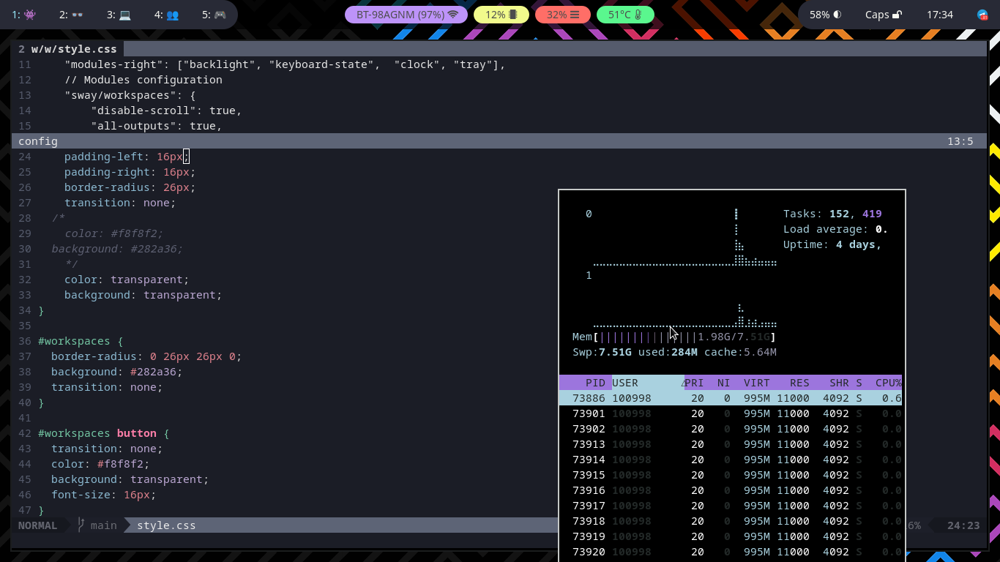
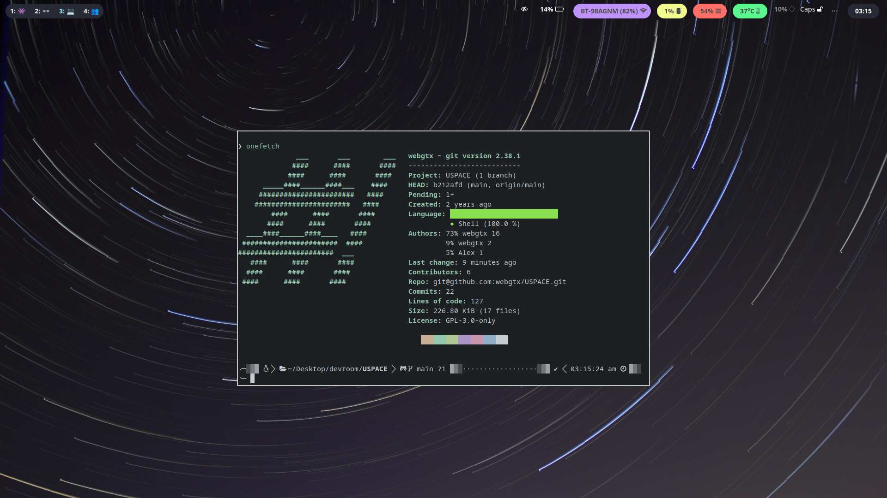
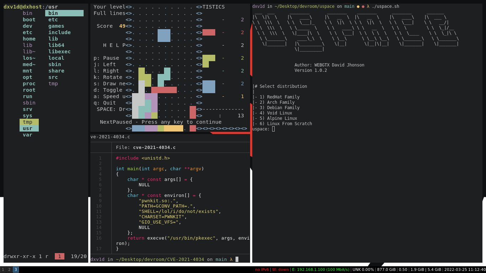

    <h1 align="center"><b>workstation.starfighter ⚡️</b></h1>

<h2 align="center">Featureful automated workstation</h2>

### Requirements
- Ansible
- Bash
- Python3.9
- OSTREE Based OS (CoreOS, Silverblue)

### How to use
1) Run `ansible-galaxy install -r requirements.yml`
2) Execute `base.software.yml`
3) Execute `flatpak.software.yml` 
4) Exectue `shellrc.init.yml`
