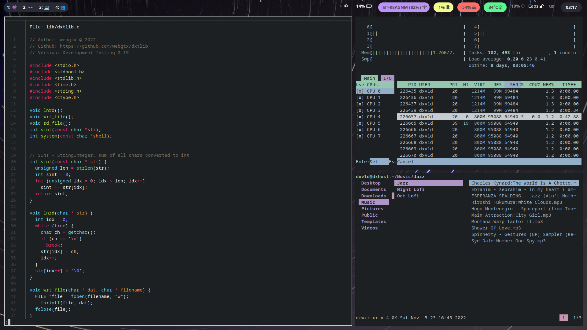

<div>
    <h1 align="center"><b>USPACE</b></h1>
</div>

<div>
<h2 align="center">UserSpace - Fully automatic SWAY/I3 environment installation</h2>
</div>

<div>



</div>

### Requirements 
- Ansible
- Bash 
- Python3.9

### Installation
```bash 
./uspace.sh
```
